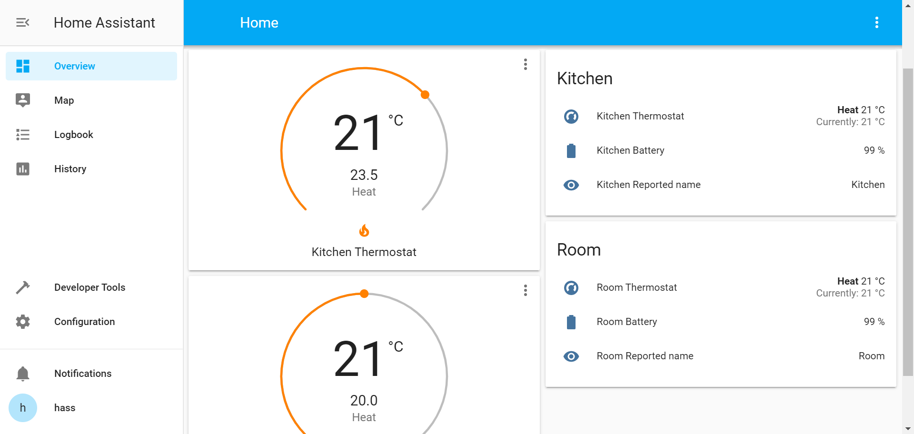
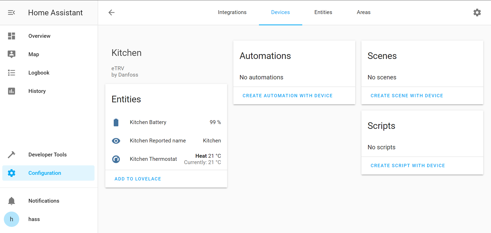

# etrv2mqtt
MQTT bridge for Danfoss eTRV thermostats. Supports MQTT autodiscovery in Home Assistant.



Device links are supported so Home Assistant sees all sensors as a single logical entity


## Installation
```sh
mkdir -p ~/venv/etrv2mqtt
virtualenv ~/venv/etrv2mqtt
~/venv/etrv2mqtt/bin/pip3 install 'git+https://github.com/keton/etrv2mqtt.git'
```

## Configuration

`config.json` example:
```json
{
    "$schema": "https://raw.githubusercontent.com/keton/etrv2mqtt/master/etrv2mqtt/schemas/config.schema.json",
    "mqtt": {
        "base_topic": "etrv",
        "server": "localhost",
        "port": 1883,
        "autodiscovery": true
    },
    "poll_interval": 600,
    "retry_limit": 5,
    "thermostats": [
        {
            "topic": "Room",
            "address": "00:01:02:03:04:05",
            "secret_key": "01020304050607080910111213141516"
        },
        {
            "topic": "Kitchen",
            "address": "02:03:04:03:04:05",
            "secret_key": "11121304050607080910111213141516"
        }
    ]
}
```

## Getting MAC addresses and secret keys
1. Scan for nearby thermostats: `sudo ~/venv/etrv2mqtt/bin/python3 -m libetrv.cli scan` 
2. Get secret key for a device: `~/venv/etrv2mqtt/bin/python3 -m libetrv.cli device --device-id 01:02:03:04:05:06 retrieve_key`. Push physical button on thermostat when prompted.

## Running
### From terminal (for debugging)
`~/venv/etrv2mqtt/bin/etrv2mqtt config.json` 
Configured devices should be automatically added to homeassistant as long as MQTT autodiscovery is enabled.

### As systemd service
* Create `/etc/systemd/system/etrv2mqtt@YOUR_USER.service`file with YOUR_USER replaced by the user account that etrv2mqtt is installed to. For example default raspbian user is named `pi` so the service file name is `/etc/systemd/system/etrv2mqtt@pi.service`.
* use following template:

    ```
    [Unit]
    Description=etrv2mqtt
    After=network-online.target

    [Service]
    Type=simple
    User=%i
    Environment="LOGURU_LEVEL=INFO"
    ExecStart=/home/%i/venv/etrv2mqtt/bin/etrv2mqtt /home/%i/etrv2mqtt.config.json
    Restart=on-failure
    RestartSec=10s

    [Install]
    WantedBy=multi-user.target
    ```
* save your `config.json` as `~/etrv2mqtt.config.json` or edit `etrv2mqtt@YOUR_USER.service` accordingly
* Update systemd configuration and start the service
    ```sh
    sudo systemctl daemon-reload
    sudo systemctl enable etrv2mqtt@YOUR_USER.service
    sudo systemctl start etrv2mqtt@YOUR_USER.service
    ```

    